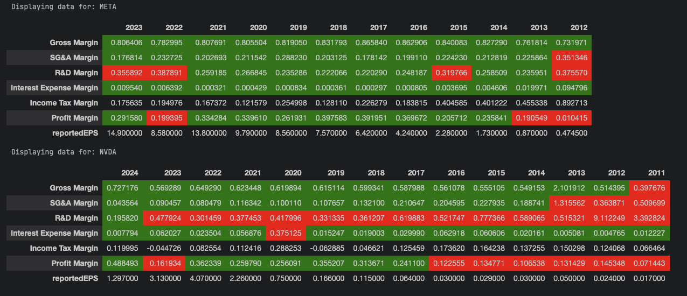

# Business Research
This repository contains the business_research project, designed to analyze and process financial data for various business entities. 
The project integrates with external APIs; Performs financial ratio calculations based on [Warren Buffett and the Interpretation of Financial Statements: The Search for the Company with a Durable Competitive Advantage](https://www.goodreads.com/book/show/4427672-warren-buffett-and-the-interpretation-of-financial-statements)

### Pre-requisites
- A free or paid API key from https://www.alphavantage.co/

### Installation
1. `python -m venv venv`
2. `source venv/bin/activate`
3. `pip install -r requirements.txt`

### How-to read financial ratios
1. In project root directory and make a copy from config.example:

`cp research/alphavantage/config.example research/alphavantage/config.yaml`

2. Enter api_key and desired company tickers.
3. Run `alphavantage.ipynb`
4. Run `research.ipynb` 
